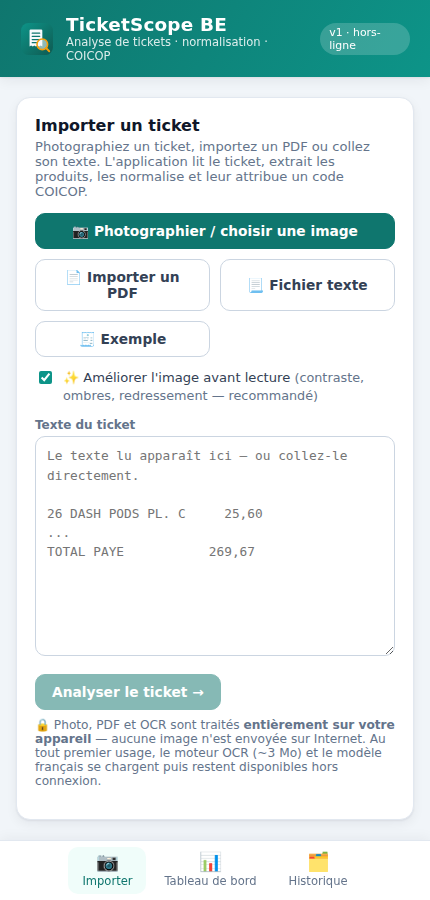
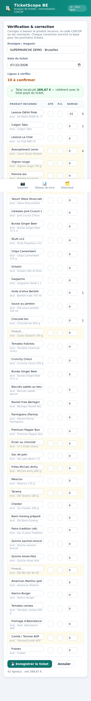
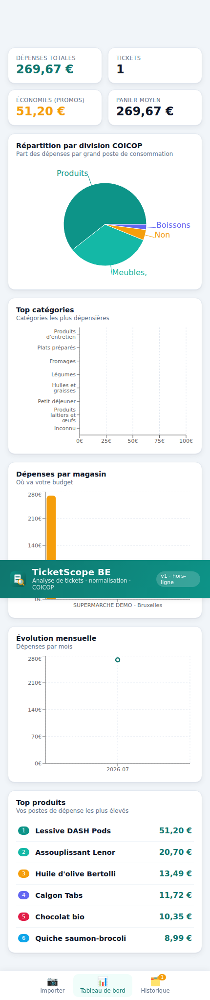
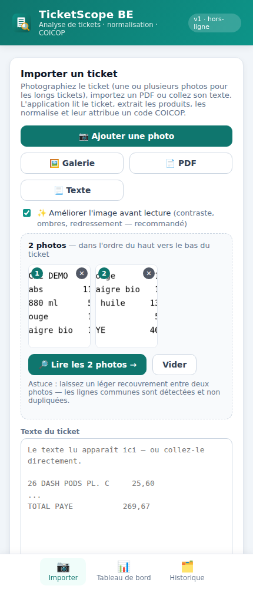

# TicketScope BE

Application web (PWA) d'analyse de tickets de caisse pour le marché belge :
importez un ticket, l'application **extrait les produits, les normalise, leur
attribue un code COICOP** avec un taux de confiance, puis produit des
**tableaux de bord** de dépenses et des **exports Excel / CSV / JSON**.

Cette version **V2** est entièrement **côté client** : tout le traitement se
fait dans le navigateur, aucune donnée ne quitte l'appareil, et l'application
fonctionne **hors connexion** une fois installée.

| Import | Correction & COICOP | Tableau de bord |
|:---:|:---:|:---:|
|  |  |  |

## Fonctionnalités (V2)

- 📷 **Import** d'un ticket par **photo** (OCR), **PDF**, fichier `.txt` ou
  copier-coller. L'OCR image (Tesseract.js) et la lecture PDF (pdf.js) tournent
  **entièrement dans le navigateur** — aucune image n'est envoyée sur Internet.
  Les PDF « numériques » sont lus via leur texte intégré ; les PDF scannés
  passent par l'OCR.
- ✨ **Mode IA (Claude Vision)** en option : au lieu de l'OCR local, la photo (ou
  le PDF) est lue par **Claude Haiku ou Sonnet**, qui extrait, normalise et
  classe les produits (COICOP) en un seul appel — bien plus précis sur les
  photos difficiles. **Clé API personnelle stockée sur l'appareil** (BYOK) ;
  aucun backend. En mode IA, l'image est envoyée à l'API Anthropic (l'OCR local
  reste 100 % hors-ligne et par défaut).
- 🧵 **Multi-photo pour les longs tickets** : capturez le ticket en plusieurs
  photos (du haut vers le bas, avec un léger recouvrement). Chaque tranche est
  lue par OCR puis **recollée automatiquement** — les lignes communes au
  recouvrement sont détectées et **non dupliquées** (voir `src/lib/stitch.js`).
- ✨ **Pré-traitement d'image** avant OCR (activable) : correction d'orientation
  EXIF, redimensionnement, niveaux de gris, **égalisation de l'éclairage
  (suppression des ombres)**, étirement de contraste, débruitage et
  **redressement automatique (deskew)**. Sur une photo difficile (ombre + biais),
  cela fait passer la lecture de **0 à plusieurs lignes** correctement reconnues.
  Un aperçu montre l'image « telle que vue par l'OCR ».
- 🧠 **Extraction & normalisation** : détection de l'enseigne, de la date, des
  produits, quantités, prix unitaires et promotions.
  - regroupe les lignes identiques (`4 × 25,60`) ;
  - rattache les remises à l'article (`-51,20` → net recalculé) ;
  - ne compte pas deux fois les remises du récapitulatif.
- 🏷️ **Classification COICOP** avec **taux de confiance** et catégorie fine,
  à partir d'une base de connaissances produits.
- ✏️ **Écran de correction** : produit, quantité, prix, code COICOP, catégorie.
  Chaque correction **enrichit la base** (auto-apprentissage local).
- 🔎 **Contrôle de cohérence** : total recalculé vs total payé du ticket.
- 📊 **Tableaux de bord** : dépenses par division COICOP, par catégorie, par
  magasin, évolution mensuelle, top produits, économies réalisées.
- 🗂️ **Historique** avec recherche instantanée (produit, catégorie, COICOP, magasin).
- ⬇️ **Exports** Excel (`.xlsx`, feuilles *Lignes* / *Synthèse COICOP* /
  *Tickets*), CSV et JSON — prêts pour Excel ou Power BI.
- 📱 **PWA** installable sur Android, iPhone, Windows, Mac ; fonctionne hors ligne.

## Démarrage

```bash
npm install
npm run dev        # serveur de développement (http://localhost:5173)
npm run build      # build de production dans dist/
npm run preview    # sert le build de production
npm test           # tests unitaires (parseur + classification)
```

Pour l'essayer immédiatement : ouvrez l'application, cliquez sur
**« Charger un ticket d'exemple »**, puis **« Analyser le ticket »**.

## Déploiement (Vercel)

Le dépôt est prêt pour **Vercel** (config dans `vercel.json`) — aucun réglage
manuel à saisir. Pour héberger TicketScope à côté de vos autres projets :

1. Sur [vercel.com](https://vercel.com) → **Add New… → Project**.
2. **Import Git Repository** → choisissez ce dépôt GitHub.
3. Vercel détecte le framework **Vite** et lit `vercel.json` automatiquement :
   - *Build Command* : `npm run build` (copie les fichiers OCR puis build Vite) ;
   - *Output Directory* : `dist` ;
   - réécriture SPA (`/* → /index.html`) et cache correct du *service worker*.
4. **Branche de production** : sélectionnez `main` (Settings → Git → Production
   Branch) — c'est celle qui reçoit les mises à jour.
5. **Deploy**. Les déploiements suivants sont automatiques à chaque push sur `main`.

> Le mode ✨ IA (Claude Vision) est **BYOK** : la clé API reste sur l'appareil de
> l'utilisateur (aucune variable d'environnement à configurer sur Vercel).

Le fichier `netlify.toml` est conservé pour référence (déploiement Netlify
équivalent) ; il n'a aucun effet sur Vercel.

## Architecture

```
src/
  data/
    coicop.js        Référentiel des codes COICOP (libellés, divisions)
    dictionary.js    Base de connaissances produits (libellés bruts → COICOP)
    sampleTicket.js  Ticket de démonstration
  lib/
    format.js        Normalisation de texte, parsing des montants, formats € / dates
    imagePrep.js     Pré-traitement image (ombres, contraste, deskew) avant OCR
    claudeVision.js  Mode IA : lecture du ticket par Claude (vision) -> JSON structuré
    stitch.js        Recollage de plusieurs photos d'un long ticket (dédup recouvrement)
    ocr.js           OCR image (Tesseract.js) + lecture PDF (pdf.js) → texte
    stitch.test.js   Tests unitaires du recollage
    parser.js        Texte du ticket → enseigne, date, lignes, totaux
    classifier.js    Ligne → produit normalisé + COICOP + confiance
    storage.js       Persistance locale (tickets + base apprise)
    exporters.js     Exports Excel / CSV / JSON
    parser.test.js   Tests unitaires
  components/        Interface React (Import, Correction, Tableau de bord, Historique)
scripts/
  prepare-ocr.mjs    Copie le moteur Tesseract (worker + WASM) dans public/tesseract/
public/tesseract/    Actifs OCR servis localement (aucun CDN) ; lang/ = modèle FR
```

Le **parseur est découplé de la source d'entrée** (`ocr.js` → texte →
`parseTicket()`), ce qui permet d'ajouter d'autres sources sans toucher au reste.

### OCR & lecture PDF (100 % local)

- **Images** : `Tesseract.js` (WebAssembly). Le worker et le cœur WASM sont
  copiés depuis `node_modules` par `scripts/prepare-ocr.mjs` (lancé avant
  `dev`/`build`) et servis depuis `public/tesseract/`. Le modèle français
  `lang/fra.traineddata.gz` est versionné dans le dépôt.
- **Pré-traitement** (`imagePrep.js`) : avant l'OCR, l'image est corrigée
  (orientation EXIF, éclairage/ombres via division par le fond, contraste,
  débruitage, redressement). Désactivable via une case à cocher.
- **PDF** : `pdf.js` lit d'abord le texte intégré (PDF numérique) ; si la page
  est scannée, elle est rendue en image, **pré-traitée**, puis passée à l'OCR.
- **Multi-photo** (`stitch.js`) : pour un long ticket, chaque photo est lue
  séparément puis les textes sont recollés en détectant les lignes communes au
  recouvrement (similarité de Dice sur bigrammes), afin de ne pas dupliquer.
- Le service worker met ces actifs en cache à la première utilisation
  (`runtimeCaching`), de sorte que l'OCR fonctionne ensuite **hors connexion**.
  Aucune image ni PDF ne quitte l'appareil.



### Base de connaissances & COICOP

La base produits (`src/data/dictionary.js`) et le référentiel COICOP
(`src/data/coicop.js`) sont dérivés du jeu de référence
`ticket_proxy_coicop.xlsx`. Chaque entrée relie des **libellés bruts** (souvent
abrégés sur les tickets) à un **produit normalisé**, une **marque**, un **code
COICOP** et une **catégorie**. Les corrections de l'utilisateur ajoutent des
entrées apprises, stockées localement, prioritaires lors des classifications
suivantes.

## Vie privée

Aucune donnée personnelle n'est transmise : tickets, produits et corrections
sont conservés uniquement dans le stockage local du navigateur (`localStorage`).

## Feuille de route

- **V1** — import texte, extraction, classification COICOP, correction,
  tableaux de bord, exports, PWA hors-ligne.
- **V2 (cette version)** — import **photo (OCR) / PDF**, **pré-traitement
  d'image** (ombres, contraste, redressement), **capture multi-photo** avec
  recollage automatique.
- **V3** — apprentissage automatique avancé, comparateur de prix entre
  enseignes, synchronisation cloud, modèles OCR multilingues, scan de
  codes-barres (EAN), intégration bancaire, listes de courses, alertes prix,
  suivi nutritionnel et empreinte carbone, *Data Explorer* façon Power BI
  (tableaux croisés, requêtes en langage naturel).
